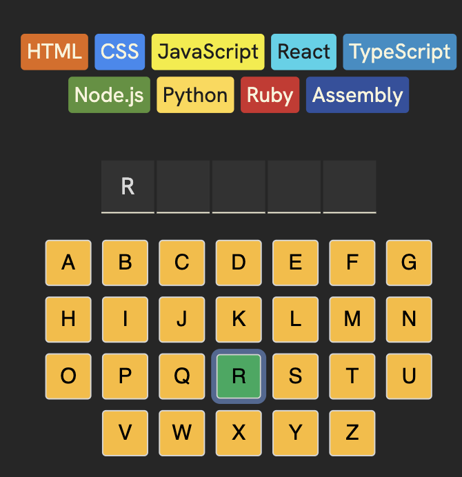

# Accessibility
* Color contrast => 4.5: 1
* Pair the color with shape
* Alt text for img

## aira
* ARIA shorts for Accessible Rich Internet Applications. 
* It fills in a gap when HTML's native sementics fall short. 

## aria-label
* Add it for input, Link, button, to give the screen reader for context.
* In this case, if we don't add the aria-label, the screen reader will just say A, B, C; But with the aria-label, the user know it is actually a letter. 
```jsx
<button
    aria-label={`Letter ${letter}`}
>
    {letter.toUpperCase()}
</button>
```

## aria-live & role & sr-only
* Check if any part of the page is dynamically rendered, including the popup, search result...
    * polite: If the user is currently reading a paragraph, the screen reader will not interrupt them. It waits until the user stops typing or the screen reader finishes speaking its current sentence.
    * assertive: Interrupts immediately. Clears the screen reader's queue and drops everything to read the update.
```jsx
<section 
    aria-live="polite" 
    role="status"
    className={gameStatusClass}
>
    {renderGameStatus()}
</section>
```
* Sometimes we can combine aria-live with sr-only, to tell the screen reader something has benn updated, but not display on the screen.
```jsx
return (
    <div 
        aria-live="polite" 
        role="status"
        className="sr-only"
    >
        {gameWon && <p>Congratulations! You won! Press "New Game" to start again.</p>}
    </div>
)
```
```css
.sr-only {
    position: absolute;
    width: 1px;
    height: 1px;
    padding: 0;
    margin: -1px;
    overflow: hidden;
    clip: rect(0, 0, 0, 0);
    white-space: nowrap;
    border: 0;
}
```
* Another example, is to read the letter which is currently being rendered.
* The screen reader can only read out the `string`, so we use `join`.
* Add a `.` can let the screen reader pause between the letters.
```jsx
<section 
    className="sr-only" 
    aria-live="polite" 
    role="status"
>
    <p>Current word: {currentWord.split("").map(letter => 
    guessedLetters.includes(letter) ? letter + "." : "blank.")
    .join(" ")}</p>
</section>
```


## aria-disabled
* Announce when a `button is disabled`
* In this case, when the users uses a tab key to tab through all the letters, so we disable the ones which have already been chosen.
```jsx
const keyboardElements = alphabet.split("").map(letter => {
    const isGuessed = guessedLetters.includes(letter)
    const isCorrect = isGuessed && currentWord.includes(letter)
    const isWrong = isGuessed && !currentWord.includes(letter)
    const className = clsx({
        correct: isCorrect,
        wrong: isWrong
    })

    return (
        <button
            className={className}
            key={letter}
            disabled={isGameOver}
            aria-disabled={guessedLetters.includes(letter)}
            onClick={() => addGuessedLetter(letter)}
        >
            {letter.toUpperCase()}
        </button>
    )
})
```

## aria-checked
Indicates whether the element is checked (true), unchecked (false)
```html
<div 
    id="toggleTheme" 
    onclick="toggleTheme()" 
    role="switch" 
    aria-checked="false" 
    tabindex="0"
>
    Light Mode
</div>
```

## aira-expanded & aira-haspopup & role & aria-expand & useId
- This is often used for a expanded menu
- useId is a built in React Hook that allows us to generate stable IDs that will persist from one render to the next.
```jsx
export default function Menu({ children }) {
    const [open, setOpen] = React.useState(false)
    const menuId = React.useId()

    function toggle() {
        setOpen(prevOpen => !prevOpen)
    }

    return (
        <MenuContext.Provider value={{open, toggle, menuId}}>
            <div className="menu" role="menu">
                {children}
            </div>
        </MenuContext.Provider>
    )
}

export { MenuContext }
```
```jsx
export default function MenuButton({ children }) {
    const { toggle, open, menuId } = React.useContext(MenuContext)
    return (
        <Button 
            onClick={toggle} 
            aria-expanded={open} 
            aria-haspopup="true"
            aria-controls={menuId}
        >{children}</Button>
    )
}
```
```jsx
export default function MenuDropdown({ children }) {
    const { open, menuId } = React.useContext(MenuContext)

    return open ? (
        <div className="menu-dropdown" id={menuId} >
            {children}
        </div>
    ) : null
}
```

## aria-press
for the buttons, to indicate if they are pressed
```jsx
return (
    <button 
        style={styles}
        onClick={props.hold}
        aria-pressed={props.isHeld}
        aria-label={`Die with value ${props.value}, 
        ${props.isHeld ? "held" : "not held"}`}
    >{props.value}</button>
)
```


```html
<p id="activity" aria-live="polite">Find something to do</p>
```
### An example to show win status

```css
.sr-only {
    position: absolute;
    width: 1px;
    height: 1px;
    padding: 0;
    margin: -1px;
    overflow: hidden;
    clip: rect(0, 0, 0, 0);
    white-space: nowrap;
    border: 0;
}
```


* aria: aria-live, aria-press, aria-checked, aria-label
