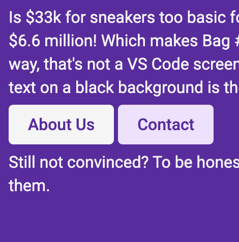
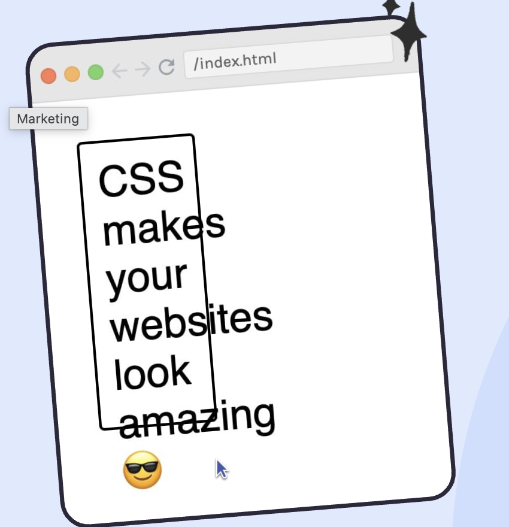

# Basics

## rgba
RGBA stands for Red, Green, Blue, and Alpha
* The red, green, and blue values range from 0 to 255 (or 0–100%)
* Alpha ranges from 0 (fully transparent) to 1 (fully opaque)

## Organisation with comment
```css
body{
    font-size: 16px;
    color: #2b283a;
    font-family: 'Roboto', sans-serif;
    margin: 0;
}

/* typography */

h1{
    color: whitesmoke;
    font-size: 36px;
    margin: 0;
}


/* links */

a{
    color: #ef5839;
    text-decoration: underline dotted; 
}

a:hover{
    color: #d4b44c;
}


/* layout */
header{
    background-color: #5f29a3;
    padding: 45px 0;
}

section{
    padding: 45px 0;
}
```

## Elements display
### Block element
`<div>`,`<p>`,`<h1>` are all block element.  
* They stack on top of each other.  
* Set height and margin top and bottom. ✅

### Inline elements
`<a>`, `<span>`, `` are inline elements.  
* They sit side by side.  
* They are given white space at the bottom to make sure the elements are not overalapped.   
* Can't set height and margin top and bottom. ❌  

### Inline-block elements
`<button>`, `<input>` are inline-clock elements.  
* Sit side by side.  
* Set height and margin top and bottom. ✅
```css
a {
	/* save the issue of overlapping buttons */
    display: inline-block;
	margin-top: 20px;
} 
```


## Order
For the same level selecor, the down one override the top one. 

### Specificity
Different seletors have different points: 
- element: 1 point
- class: 10 points
- id: 100 points  

Many developer don't use id for css.
- Use element selector for general rules
- Use class selector for specificity

### !important
Use `!important` to override all the styles, but `don't use it` if neccessary!
```css
.container .title, .container .sub-title {
    color: purple;
}

.sub-title {
    color: darkgreen !important; 
}
```

## Compound selector
Use compound selector for more specificity, but `try not to use it too much`.  
Add all the points to calculate the points of compound selector.
```css
.container .section-two {
    ...
}
```


## Main class and modifier class
```html
<div class="price price-up">
```
```css
.price {
    font-weight: bold;
    padding: 5px;
    margin-top: 20px;
    border-radius: 2.6px;

}
.price-up{
    box-shadow: 0px 0px 3px #4CBB17;
    color: #4CBB17;
}
```

## Overflow
```css
div {
    border: 2px solid black;
    font-size: 2rem;
    width: 70px;
    height: 200px;

    /* always add a scroll bar */
    overflow: scroll; 

    /* if the content exceeds the border of the container, add a scroll bar */
    overflow: auto; 

    /* if the content exceeds the border of the container, ignore the content */
    overflow: hidden;
    
    /* always show the content exceeding the border */
    overflow: visible;

    /* overflow-x: hidden and overflow-y:visible don't work together */
    overflow-x: hidden;
    overflow-y: visible;   /* ❌ */
}
```


## Hide the element
* The element still takes the space. It will not cause the layout shift. 
```css
.container {
    visibility: hidden;
}
```
* It will not take up any space on the page. 
```css
.container {
    display: none; 
}
```