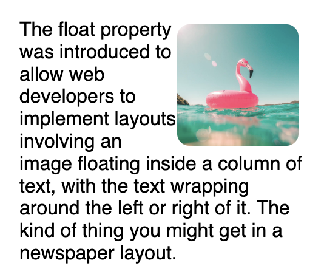
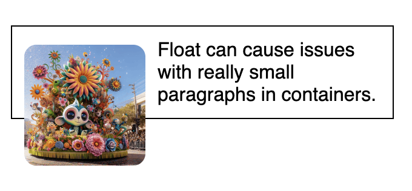

# Image

## alt text
```html

```

## background
```css
.container {
	/* always put a background color simlar to the image color */
    background: #9480e4 url("images/intro-bg.png");
    background-repeat: no-repeat;
    background-position: right;
    background-size: cover;
}
```


### background-blend-mode
```css
.about-section {
    background-image: url(images/clouds.jpg);
    background-color: rgba(255, 255, 255, 0.5);
    background-blend-mode: lighten;
    background-size: cover;
}
```


## Resize the image: object-fit
1. We can set the container and set it the correct width and height we want
```html
<div className="main-image-container">
    
</div>
```
```css
.main-image-container {
    width: 125px;
    height: 168px;
    overflow: hidden;
}
```
2. sets how the content of the image should be resized to fit its container.
```css
img {
    width: 100%;
    height: 100%;
    object-fit: cover;
}
```

## role and aria-label when you can't use an HTML img tag
make the `container div and everything inside` treated as an image.  
```html
<!-- the screen reader will skip all the children content inside the container, so the aria-label needs to include the text inside.  -->
<div class="meme-container" role="img" aria-label="A cheeky smiling dog with text saying 'when the cat gets blamed for something you did'.">
    <div class="meme-text">
        <h1>
            When the cat gets blamed for something you did
        </h1>
    </div>
</div>
```
```css
.meme-container {
    background-image: url('husky.jpeg');
    background-size: cover;
}
```

## Float property
```css
img {
    height: 100px;
    border-radius: 10px;
    padding: 0;
    margin: 5px 10px 5px 0;
    /* img with text around it */
    float: right; 
}
```


```css
Remove any float
.para-1 {
    /* nothing will float to the right side of the element */
    clear: right;
    clear: both;
}
```
Stretch the container to include the float inside. 
```css
.para-3 {
    display: flow-root;
}
```

