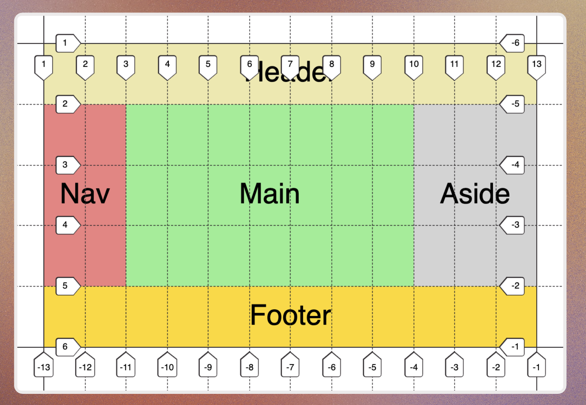
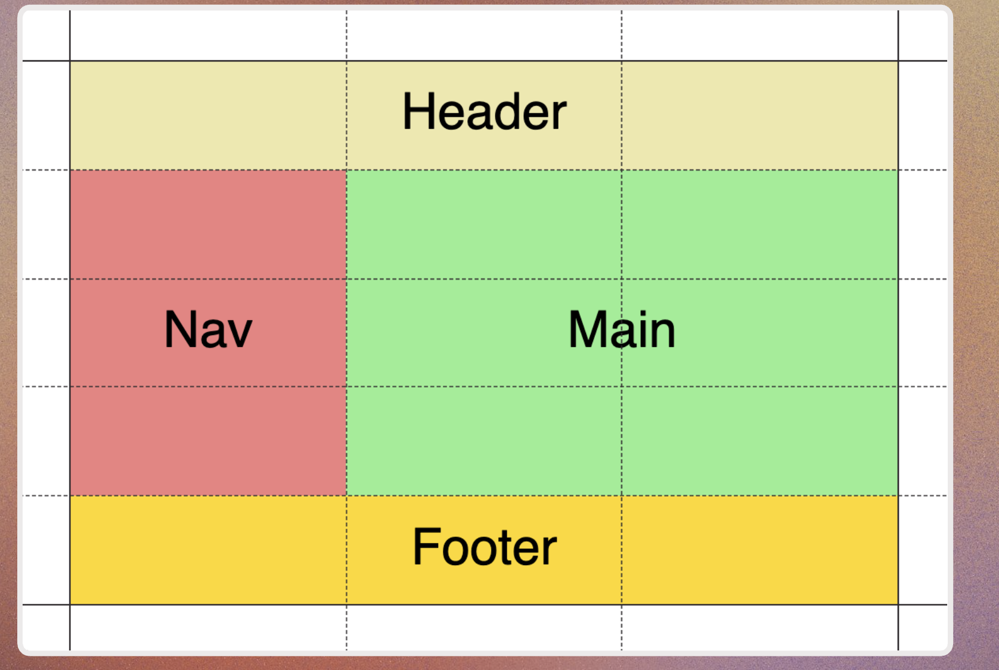
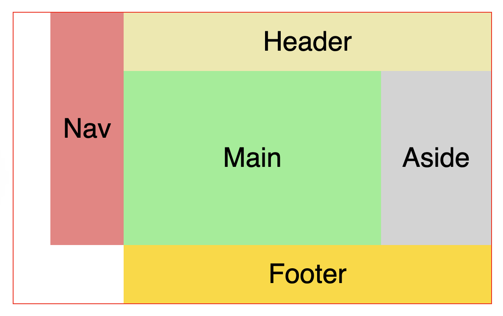
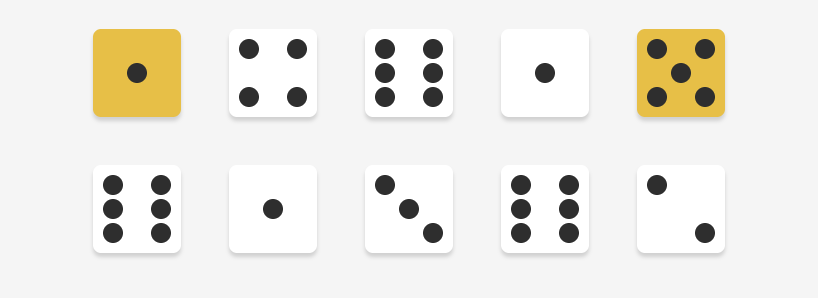

# Grid
Margin no longer collapse.  
The default layout of grid is just a single column that lay out all the element vertically.

```CSS
.grid-container {
    display: grid;

    /* Add more columns by declare their width */
    /* grid-template-columns: 1fr 1fr;
    grid-template-rows: 5em 5em; */
    grid-template: 5em 5em / 1fr 1fr;

    /* row-gap: 0.6em; 
    column-gap: 0.3em;  */
    gap: .3em .6em;

    border: 2px solid black;
}
```

## grid-template & grid-auto
`grid-auto-row`: specify a given height to all the implicitely generated row tracks.  
```css
.container{
    display:grid;
    grid-template-rows:100px;
    grid-auto-rows:75px;
}

Row1 → 100px
Row2 → 75px
Row3 → 75px
Row4 → 75px
```


## repeat
* repeat(how many times, what to repeat) 
```css
.container {
    grid-template-columns: repeat(5, 30px)
}
```

## fr
```css
.container {
    /* we have a total of 5 fractions and the first item takes up 2  */
    grid-template-columns: 2fr repeat(3, 1fr);  
}
```
* Auto: takes up the space it needs based on the text width
* The rest of the space is divided equally to 3 pieces. 
```css
.container {
    grid-template-columns: auto repeat(3, 1fr);
}
```

## Box alignment
```css
justify-content
align-items
align-self
```

## grid lines
```css
nav {
    grid-column:  1 / 3;
    grid-row: 2 / 5;
}
```



## span
```css
.grid-container {
    display: grid;
    grid-template: repeat(5, 1fr) / repeat(3, 1fr);
}
 
header {
    background-color: palegoldenrod;
    grid-column: span 3;
}
nav {
    background-color: lightcoral;
    grid-row: span 3; 
}
main {
    background-color: lightgreen;
    grid-row: span 3; 
    grid-column: span 2;
}
footer {
    background-color: gold;
    grid-column: span 3;
}
```


## grid-template-areas, grid-area
* give each section a `grid-area` name
* list the grid-area name in the grid-template-areas
* use . to indicate a space. We can use any length of . as long as there's no space between them
```css
.grid-container {
    display: grid;
    grid-template: repeat(5, 1fr) / repeat(13, 1fr);
    grid-template-areas: 
        ". nav nav head head head head head head head head head head"
        ". nav nav main main main main main main main aside aside aside"
        ". nav nav main main main main main main main aside aside aside"
        ". nav nav main main main main main main main aside aside aside"
        ".... .... foot foot foot foot foot foot foot foot foot foot";
}

header {
    grid-area: head;
    background-color: palegoldenrod;
}

nav {
    grid-area: nav;
    background-color: lightcoral;
}

main {
    grid-area: main;
    background-color: lightgreen;
}

aside {
    grid-area: aside;
    background-color: lightgray;
}

footer {
    grid-area: foot;
    background-color: gold;
}
```


* when adding number after grid-area, it means:  
row-start:  
column-start:  
row-end:  
column-end:   
```css
.dice {
	display: grid; 
	grid-template: repeat(3, 1fr) / repeat(3, 1fr);
    place-items: center;
}

.pos-1 {
    /* row-start: 1 /
    column-start: 1 /
    row-end: auto /
    column-end: auto */
	grid-area: 1 / 1
}

.pos-2 {
	grid-area: 1 / 2
}
...

.pos-8 {
    grid-area: 3 / 2
}

.pos-9 {
    grid-area: 3 / 3
}
```


## Fluid
* `grid-auto-flow: dense`: It ignore the HTML order and packs the grid items as dense as possible.  


*  `auto-fit`: the image will always fluid when needed, and automatically generates as many columns as possible. 
*  `minmax(min, max)`: define a size range that is greater than or equal to min, and less than or equal to max. The image not long has a fixed width, but has a flexible width that is only constrained by the min value. (It won't go less than 100px in the example).


```css
.grid-container {
    display: grid;
    grid-gap: .5em;
    grid-template-columns: repeat(auto-fit, minmax(100px, 1fr));

    grid-auto-rows: 75px;

    grid-auto-flow: dense;
}

.wide {
    grid-column: span 2;
}

.tall {
    grid-row: span 2;
}

.big {
     grid-row: span 2;
     grid-column: span 2;
}
```
