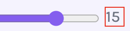

## Video
Video height and weight should be always set by **pixels** only! 

## Width
### span
for span, we need to change the display to **inline-block**, otherwise we can't change the width. 
```html
<label class="switch">
    <input type="checkbox" id="symbols-toggle">
    <span class="slider round"></span>
</label>
```
```css
.length-value {
    display:inline-block;
    width: 20px; 
    border: 1px solid red; 
}
```


## button
* In common cases, we only need to set the following codes to make the button fit the width of the content!
```css
.btn--bg {
	display: block; 
	margin-left: auto; 
	margin-right: auto; 
	width: fit-content;
}
```

* In flex, the button usually stretch to the whole width. To make it just as wide as the text, we can change the display to **block**, and add **margin**. 
```html
<div class="settings-container">
    <div>1</div>
    <div>2</div>
    <div>3</div>
    <button class="generate-btn">
        Generate passwords
    </button>
</div>
```
```css
.settings-container {
    display: flex; 
    flex-direction: column; 
    justify-content: center
}

.generate-btn {
    display: block; 
    margin: 0 auto; 
}
```


## Limit the vertical stretch
The default behaviour of a child element of a flex box container is to `vertically stretch` to fill the container.  

We can use `align-self` property to limit the stretch

We can also use `margin` property to 
- limit the stretch
- push the element to a certain position

### align-self
It allows us to take a control of an **individual** element's alignment when it is inside a flex container. 
```css
button {
    align-self: center;
    align-self: flex-bottom;
    align-self: flex-start;
}
```


## Viewpoint height 
* With a fixed header, things become complex: 
    * main-content = 100vh  
    * header = 70px floating  
    * Total visible usage: 100vh + 70px = overflow, even though they overlap. This is visual stacking.  

* To correct this, minus the height of the header from the main height
```css
.main-content {
    flex-grow: 1;
    display: flex;
    flex-direction: column;
    justify-content: space-between;
    overflow: hidden;
    height: calc(100vh - 70px); 
    margin-top: 70px; 
}
```


## Margin & Padding & gap
margin can be set as negative
```css
margin-top: -10px;
```

### the em unit
A margin / padding set in em is relative to the font size of the current element. We use `em` because it is proportional scaling.  

```css
h1 {
    font-size: 1.25em;  /* 36px */
    margin: 1em;   /* 36px */
    padding: 1.25em;  /* 36px * 1.25 */
}
```
### Button Example
For buttons, usually we can set `1em` for the right and left padding, and `0.5em` for the top and bottom padding to make sure everything is proportionate.   

For the margin between buttons, it can be the same.  
```css
.btn {
    font-size: 1.125em;
    padding: 0.5em 1em;
    margin-right: 0.5em;
    margin-bottom: 1em;
```

## Margin collapse
`All text elements` come with spacing on top and bottom by default.

When a child element touches its parent, the top and bottom margins will merge with the margins of the parent elements. 
```html
<header>
 <!-- h1 touches the header, the margin of h1 will affect header's margin -->
	<h1>BBC NEWS</h1>
    <p class="header-text">
		<a href="" class="selected">Home</a> | 
		<a href="">World</a> | 
		<a href="">USA</a> | 
		<a href="">Europe</a> | 
		<a href="">Asia</a> | 
		<a href="">Africa</a> | 
		<a href="">Climate</a>
    </p>
</header>
```

```css
/* equals to margin top and margin bottom */
.facts-list > li {
    margin-block: 10px;
}
```

### Margin collapse solution
add padding to the parents element
```js
header{
    background-color: #b80000;
    padding: 15px 20px;
}
```

## line-height
Set the line height a `unitless` value which is approximately 1.5 times of the font size.  
```css
p {
    line-height: 1.5;
}
```

## width
use %  `percentage` for responsive design  
It always takes the percentage of width of its parent container
### Progress bar
```html
<!-- Progress container -->
<div class="prog-container">
      <div class="prog-bar">
            <div class="prog-indicator prog-33"></div>
      </div>
</div>

<!-- Progress container -->
<div class="prog-container">
      <div class="prog-bar">
            <div class="prog-indicator prog-60"></div>
      </div>
</div>
```
```css
/* for the whole bar */
.prog-bar {
    height: 20px;
    background-color: #808CB0;
    overflow: hidden;
    border-radius: 12px;
}

/* for the highlighted part */
.prog-indicator {
    height: 100%;
    background-color: hotpink;
}

/* for the different percentage for bars */
.prog-33 {
    width: 33%;
}

.prog-60 {
    width: 60%;
}
```

## max-width
use px

## viewport units
- 1vh is 1% of the viewport height.  
- 1vw is 1% of the viewport width.  
It helps create `fluid` text and content container. 

```css
nav {
    /* It will stretch to fill all the viewport. */
    min-height: 100vh;
}
```
Make the h1 size adjusted to the width of the screen. 
```CSS
@media (min-width: 576px) {
    h1 {
        font-size: 5vw;
    }
```

## Adjust line length of the paragraph
To avoid making the paragraph stretch too long if the screen is wide. 
```css
.main-content p,
form {
    max-width: 450px;
}
```
