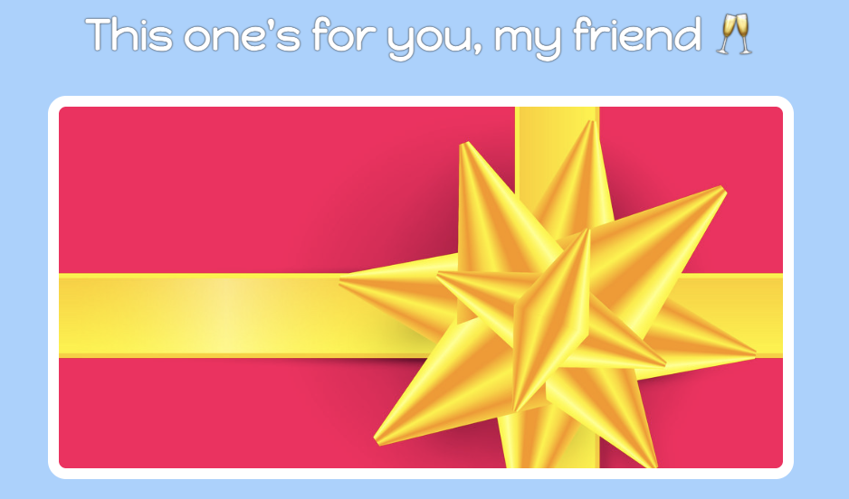

# Pseudo class
```CSS
/* unvisited link */
a:link {
  color: #FF0000;
}

/* visited link */
a:visited {
  color: #00FF00;
}


/* selected link */
a:active {
  color: #0000FF;
}
```

## hover and focus
Remember to make the outline none
```css
input:focus, input:hover{
    /* remove the default border when focus */
    outline: none;
    /* add the new border */
    border: 1px solid red;
}
```
### Uncover the image when hovering
```css
.img {
    background-image: url("...old.png")
}

.img:hover {
    background-image: url("...new.png")
}
```


# Pseudo Element
## marker
```css
.facts-list > li::marker {
    color: #61DAFB;
}
```

## before
```css
.add-ingredient-form > button::before {
    content: "+";
    margin-right: 5px;
}
```
Customized underline
```css
span {
    position: relative;
}

span:before {
    position: absolute;
    content: '';
    height: .2em;
    width: 80%;
    bottom: .1em;
    z-index: -1;
    background: #71AE21; 
}
```


## nth-of-type
```js
div.card-slot:nth-of-type(1) {
    margin-bottom: 50px;
}
```

## disabled
```css
.decrement:disabled{
    color: whitesmoke;
    opacity: 0.2;
    cursor: not-allowed;
}
```

## last-child
```css
.header__sm-menu li:not(:last-child) {
    border-bottom: 1px solid var(--color-black);
}
```