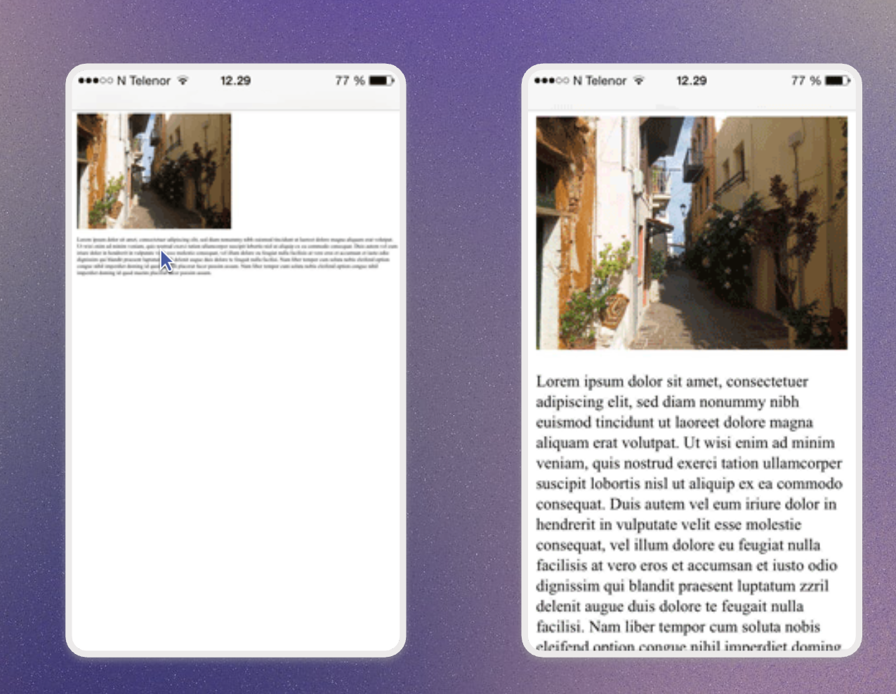

## viewport - adjust the width for different devides
```html
<head>
    <meta name="viewport" content="width=device-width, initial-scale=1.0">
</head>
```
 

## box-sizing
When we add the padding or margin to the element, it makes the whole element bigger.
It also happens if we set with percentage, like 100%. The div will stretch out of the viewport. 
**Always set the box-sizing in the universal selector using an asterisk.** It works throughout the page.
```css
*, *::before, *::after {
    box-sizing: border-box;    
}
```
Once we add the box-sizing, the height and weight is set for the `whole div`, not the inside content!

## Inheritance
```css
input, button {
    font-family: inherit;
}
```

## sr-only
only for screen readers and we don't want them render on the page
```css
.sr-only {
    position: absolute;
    width: 1px;
    height: 1px;
    padding: 0;
    margin: -1px;
    overflow: hidden;
    clip: rect(0, 0, 0, 0);
    white-space: nowrap;
    border: 0;
}
```

## lazy loading
Don't download this image until the user scrolls down and is about to see it.
```css
loading="lazy"
```

## Common design
### box-shadow
* X and Y offsets relative to the element 
* blur 
* spread radius
* color
```css
/* for the header section */
box-shadow: 0px 1px 3px 0px rgba(0, 0, 0, 0.10), 0px 1px 2px 0px rgba(0, 0, 0, 0.06);

/* for an input box */
box-shadow: 0px 1px 2px 0px rgba(0, 0, 0, 0.05);
```

### Body background image
```css
body {
    background: no-repeat center center fixed; 
    background-size: cover; 
}
```

### text-shadow to stand the text out from the white background
```css
text-shadow: 0px 0px 20px #aaaaaa;
```

## Accessibility
* Color contrast => 4.5: 1
* Pair the color with shape
* Alt text for img
* aria: aria-live, aria-press, aria-checked, aria-label
    * Add the aria-label for input, Link, button,