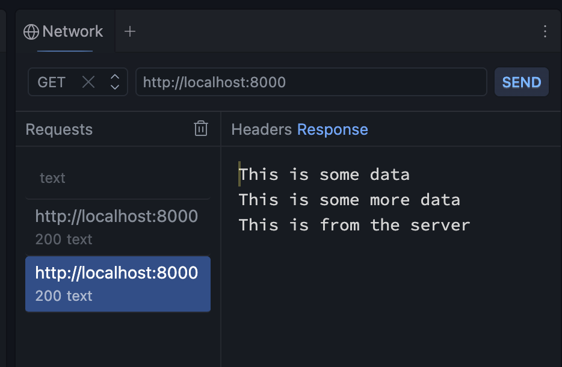

- Before Node.js came along in 2009, JavaScript was basically trapped inside the web browser (like Chrome, Safari, or Firefox), acting as the engine that made websites interactive.
- Node.js took that same JavaScript engine (specifically Google Chrome's V8 engine) and packed it into a standalone program.
- Node.js is an environment that allows us to write javascript in other places besides the browser. Because of Node.js, you can write JavaScript to run directly on your computer's operating system.

### Scenario A: Pure Frontend (No Node.js involved)
If your index.js file is hooked up to an index.html file like this:
```html
<script src="index.js"></script>
```
And you view it by double-clicking the HTML file to open it in Chrome, or by using the Live Server extension in VS Code...  

Is Node running it? **No**.   

Your computer is just using the **browser's built-in JavaScript engine** to read and execute the code. Node isn't doing any work here. This is traditional, old-school frontend development.

### Scenario B: Modern Development Tools (Node.js is running the show)
If you are working on a project where you have to open your terminal in VS Code and type a command like:
```
npm run dev

npm start

vite
```

And it gives you a local link like http://localhost:5173 to open in your browser...

Is Node running it? Yes, absolutely.

Even though you are looking at the final result in a web browser, Node.js is running a **mini web server** on your computer behind the scenes. Node is sitting in the background, watching your files in VS Code. 

While you are developing your **React app**, Node and Vite work together in the background to translate, bundle, and compile all your modern React code into standard HTML, CSS, and JS that any browser can easily read.


## REPL
- `REPL` stands for Read-Eval-Print Loop. It is a quick, interactive `environment` built right into Node.js that lets you experiment with JavaScript code on the fly without having to create a file, save it, and run it.
- If you have Node.js installed, you can try this yourself:
    - Open your computer's terminal (Command Prompt, PowerShell, or Terminal on Mac).
    - Type node and hit Enter.
    - Your prompt will change (usually to a >), meaning you are now inside the REPL.
    - Now you can type JavaScript directly into your terminal

## Initilize a Package.json file
- Typing "npm init" in the terminal. The utility is running. 
- Answer the questions and input the information.
- We will get a package.json file like this
```json
{
  "name": "wild-horizons",
  "version": "1.0.0",
  "description": "a dataset of the planet’s most interesting places",
  "main": "server.js",
  "scripts": {
    "start": "node server.js"
  },
  "author": "Tom Chant",
  "license": "ISC"
}
```
- Last time, we can only run our code by which is not idea because other people shouldn't need to search for the entry point to our app. 
```
node server.js
```
- Since now we have the start scripts, we can run the server.js in the terminal by
```
npm start
```

## HTTP module
- The **ES Module approach** is the official, standardized way to split your JavaScript code into separate, reusable files and share code between them using the import and export keywords.
- `node:` indicates that we are looking for a `node` module, not a javascript module that we created ourselves. 
- HTTP module allows data to be transferred over the HTTP protocol, so we can create servers, handle requests from clients, and provide responses to those requests. 

### port
- There are 65,535 available **ports** on a computer. A port is a virtual, numbered `doorway` inside your computer’s operating system that allows specific programs to send and receive data without bumping into each other. 
- When you see an address like http://localhost:3000  while developing, you are looking at two pieces of information:
    - localhost: This is the IP address. It tells the computer to look at itself (IP address 127.0.0.1).
    - 3000: Tells the computer to hand this specific web traffic over to the exact Node.js or Vite process running in your terminal.
- port 8000 is one of the most popular "alternative" ports used by developers to `run and test web` applications locally on their computers. Just like ports 3000 or 5173, port 8000 is a safe, `unassigned` virtual doorway that developers use so they don't interfere with standard internet traffic (like your normal web browsing, which uses ports 80 and 443).

### response object method & property
- res.write(): it allows us to send something to the client
- res.end(): always end the stream with res.end. 
    - We can ignore the utf8 because it is the default format of data.
    - We can also put a call back function inside.
    - We can also just `leave it empty`, make it simply the end of the stream. 
- res.setHeader(): pass in two strings to set the Content-Type. When you call res.setHeader('Content-Type', 'application/json'), you are telling the recipient's browser or API client exactly **what kind of file** you are sending back before you actually deliver the data.
- res.statusCode: this is a `property` not method!


### request object method 
- req.url: it gives us the endpoints and query string, excluding the basic URL. 
- req.method: it returns GET / POST / PUT .....


### network client 
- It is an API `testing tool`, similar to Thunder Client or Postman inside VS Code.
- It can make a request to your Node.js server.


### API example
- Keep an eye on port 8000. The moment a request hits that doorway, fire off this exact response
```js
import http from 'node:http'
import { getDataFromDB } from "./database/db.js"

PORT = 8000

const server = http.createServer(async (req, res) => {
    
    const destination = await getDataFromDB()

    if (req.url === '/api' && req.method === 'GET') {
        res.setHeader("Content-Type", "application/json")
        res.statusCode = 200

        res.write("This is some data \n")
        // destination is a json, and we use JSON.stringify to convert it into json
        res.write(JSON.stringify(destination))  
        res.end("This is from the server", "utf8", () => {console.log("response end")})
    } else {
        res.setHeader("Content-Type", "application/json")
        res.statusCode = 404
        res.end(JSON.stringify({error: "not found", message: "The requested route does not exist"}))
    }

})

server.listen(PORT, () => console.log("Connected on port."))
```

