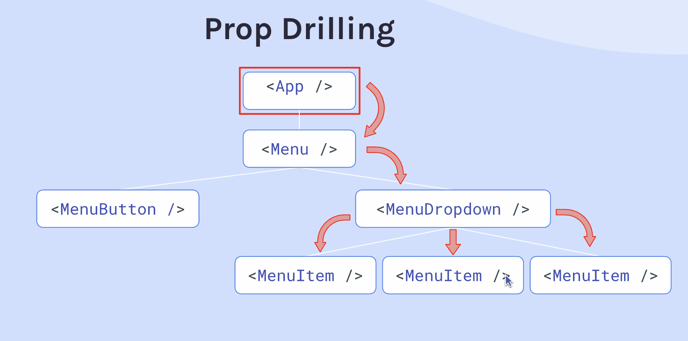
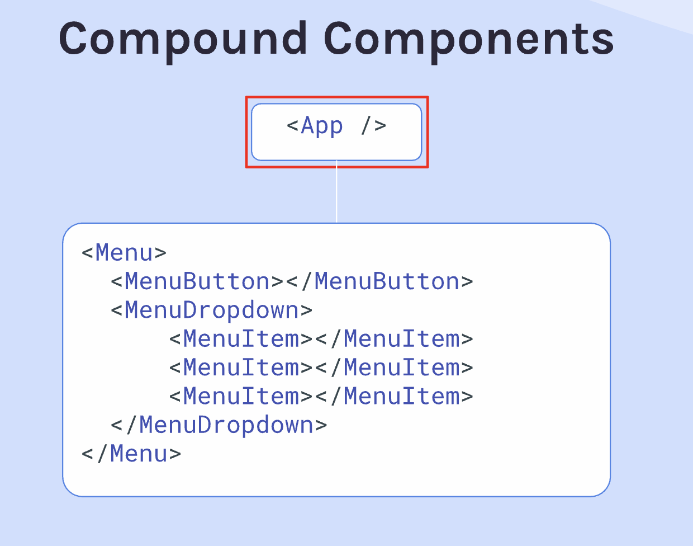
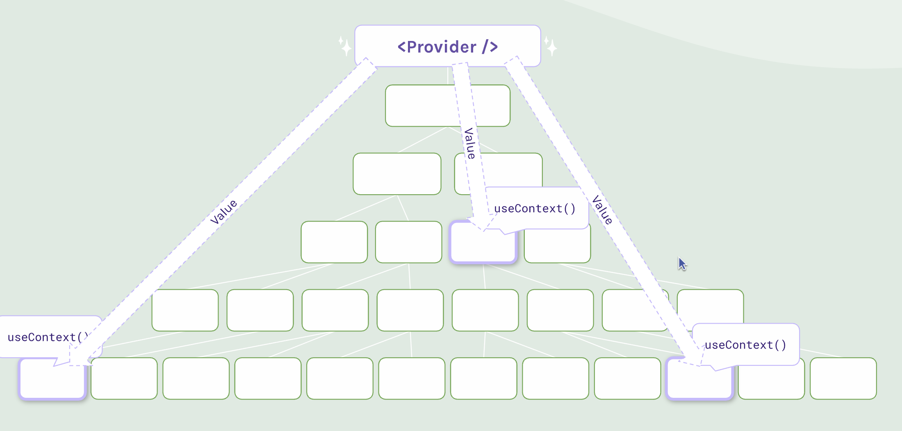

# Component
React components are meant to be `pure functions`.
* When it is given same props or state, should always return the same interface. 
* Rendering and re-rendering a component will never have any kind of side effect on an outside system

## Props
We can pass neccessary props to the component when creating a new instance of the component
```jsx 
// Contact.jsx
export default function Contact(props) {
    console.log(props)
    return (
        <article className="contact-card">
            <h3>{props.name}</h3>
        </article>
    )
}
```
```jsx 
// App.jsx
import Contact from "./Contact"
export default function App(props) {
    return (
        <main>
            <Contact name="Jean" location="Singapore"/>
            <Contact name="David" location="Netherlands"/>
        </main>
    )
}
```
```jsx
// Index.jsx
import { createRoot } from "react-dom/client"
import App from "./App"

createRoot(document.getElementById("root")).render(<App />)

// It will log out objects with all the keys and values that we passed in when calling the component
>>> {name: "Jean", location="Singapore"}
>>> {name: "David", location="Netherlands"}
```

## key
* key helps React identify which items in an array have changed, been added, or removed, so it can update the DOM efficiently.
* key can't be passed to the child component
* When we `map over` an array and create an `array of jsx element`, React needs the key that is dedicated to jsx element, so it can keep track of items every time something got rerendered.
```jsx
// Dice.jsx
export default function Dice(props) {
    return (
        <button>props.value</button>
    )
}
```
```jsx
// App.jsx
export default function App() {
    const array = [1, 2, 3]
    // Here, we create an array of jsx elements, and it need key
    const diceEl = array.map(number => <Dice 
        value={number}
        key={number} 
    />)
    return (
        <main>
            diceEl
        </main>
    )
}
```

## Pass Different Data Types
### Numbers
Numbers has to be sent inside `curly brackets` to be treated as numbers:
```jsx
createRoot(document.getElementById('root')).render(
    <Car 
        year={1969} 
        comments={[
        {author: "", text: "", title: ""},
        {author: "", text: "", title: ""}
        ]}
        img={{ 
            src: "https://scrimba.com/links/travel-journal-japan-image-url",
            alt: "Mount Fuji" 
        }}
    />
);
```

### JSX element
wrap the JSX element in {}
```jsx
<LearnSection 
    icon={<i class="fa-solid fa-layer-group section-header-icon"></i>}
    title={t('dashboard.courses')}
>
    <div className="all-courses-container">
        {unitsEl}
    </div>
</LearnSection>
```

### Bolean
```jsx
<ProjectCard
    isFeatured={true}
/>
```

## children property
- In React, whenever you put something inside a component's tags, React passes those elements to the component via a special prop called **children**.
- React evaluates children dynamically depending on what you pass:
    - 0 items: children is undefined.
    - 1 item: children is a single React Element `(object)`.
    - 2+ items: children becomes an `array` of React Elements.
```jsx
export default function ContentSection({sectionHeader, children}) {
    return (
        <div className="project-details-section">
            <h3 className="project-details__content-title">{sectionHeader}</h3>
            {children}
        </div>
    )
}
```
```jsx
import ContentSection from "./ContentSection"

export default function ProjectContent() {
    return (             
        <ContentSection
            sectionHeader="See Live"
        >
            <a href="#" className="btn" target="_blank">Live Link</a>
            <p>Check out the deployment!</p>
        </ContentSection>
    )
}
```
In this case, children will be an array containing two objects: 
```jsx
[
  { type: "a", props: { ... } },
  { type: "p", props: { children: "Check out the deployment!" } }
]
```

## props spreading
- When you use {...props} inside a JSX tag, you are telling React: "Take every key-value pair inside this object, **unpack** them, and hand them over as individual **attributes** to this HTML element." So the `props key` should be `native HTML attributes`!
```jsx
// App.js
import Button from './Button';

export default function App() {
    return (
        <Button 
            type="submit"
            className="primary-btn" 
            onClick={() => alert('Clicked!')}
        >
            Click Me!
        </Button>
    );
}
```
What Button component receives:
```js
props = {
    type: "submit",
    className: "primary-btn",
    onClick: () => alert('Clicked!'),
    children: "Click Me!"
};
```
When `React` compiles your code, the spread operator unpacks that props object. It strips away the outer curly braces of the object and writes the properties directly into the HTML tag as individual attributes
```jsx
<button 
    type={props.type} 
    className={props.className} 
    onClick={props.onClick}
    children={props.children} 
>
```

## destructure props
```jsx
export default function Contact({img, name}) {
    return (
        <article className="contact-card">
            
            <h3>{name}</h3>
        </article>
    )
}
```
```jsx
import Contact from "./Contact"

export default function App() {
    return (
        <div className="contacts">
            <Contact
                img="./images/mr-whiskerson.png"
                name="Mr. Whiskerson"
            />
            <Contact
                img="./images/fluffykins.png"
                name="Fluffykins"
            />
        </div>
    )
}
```

## rest operator
* It is very useful when we need to combine **destructure props** and **props spreading**.
* ...rest is another `object`. 
    - In most cases, it stores all the key-value pairs from props whose key is the `native HTML attributes`, so that we can separate the other properties.
    -  In this case, since children is not HTML attributes, it will be meaningless if we only use props spreading. 
```jsx
export function Button({children, ...rest}) {
    return (
        <button 
            {...rest}
        >
            {children}
        </button>
    )
}
```

## compond components
- Components that **work together** to accomplish a greater objective than might make sense to try and accomplish with a single component alone.
- compound components help you avoid having to **drill props** multiple levels down. Compound component "flatten" the heirarchy. Since I need to provide the children to render, the `parent-most component` has **direct access** to those "grandchild" components, to which it can pass whatever props it needs to pass **directly**.

  
  
 
- However, if the data/state originates at the second or third level, but the fourth or fifth level down actually needs it, you are still trapped in props drilling under the traditional compound component pattern. To solve this, we will use the context or React.Children.

### compond components with dot syntax
- To simplify the import, we can create a new js file, and put the all the children as a property of the parent element. 
```jsx
import React from 'react';
import ReactDOM from 'react-dom/client';
import Menu from "./Menu/index"

function App() {
  const sports = ["Tennis", "Pickleball", "Racquetball", "Squash"]

  return (
    <Menu>
      <Menu.Button>Sports</Menu.Button>
      <Menu.Dropdown>
        {sports.map(sport => (
          <Menu.Item key={sport}>{sport}</Menu.Item>
        ))}
      </Menu.Dropdown>
    </Menu>
  )
}

ReactDOM.createRoot(document.getElementById('root')).render(<App />);
```
```js
// ./Menu/index.js

import Menu from "./Menu"
import MenuButton from "./MenuButton"
import MenuDropdown from "./MenuDropdown"
import MenuItem from "./MenuItem"

Menu.Button = MenuButton
Menu.Dropdown = MenuDropdown
Menu.Item = MenuItem

export default Menu
```

## context
- All the component will get the value from the provider. 
- The provider is **not neccessarily at the highest level** of the the application, but it needs to be as high as it needs. If only a small subsection of the components need the context data, we can just put the provide somewhere at the common ancestor, but not the top level. 




- Create a new instance of context. 
    - It doesn't matter how you call it. Usually if it is on the top level of the App, we can call it **ThemeContext**. If it is just on the menu level, we can call **MenuContext**.
- Access the context provider by using `.Provider` to wrap the components
- Pass a `value` to all the components. 
    - It must always be literally written as value because ThemeContext.Provider is a built-in component, and `value` is a built-in prop name. 
- Export the context
```jsx
import React,from "react"
import Header from "./Header"
import Button from "./Button"

const ThemeContext = React.createContext()

export default function App() {
    return (
        <ThemeContext.Provider value="dark">
            <div className="container dark-theme">
                <Header />
                <Button />
            </div>
        </ThemeContext.Provider>
    )
}

export { ThemeContext }
``` 
- To pull the context value that is provided by the context provider, we need to use a hook `useContext()`, so import the useContext
- Also import the new instance of context we created
```jsx
import { useContext } from "react"
import { ThemeContext } from "./App"

export default function Header() {
    const value = useContext(ThemeContext)
    return (
        <header className={`${value}-theme`}>
            <h1>{value[0].toUpperCase() + value.slice(1)} Theme</h1>
        </header>
    )
}
```

### React.Children API && React.cloneElement()
- Since we can't pass props to children like this, we need to change the original children to a new children, which can pass the props.
```jsx
<div className="menu">
    {children prop=""}
</div>
```
- **We are not allowed to run children.map() in React**. So we have to use React.Children, which is just an assistant that helps you loop through the children safely.
    - The first parameter is the `array` that we want to **interacte with**. In this case, it is the `children` array.
    - The second parameter is a call back function, the call back function will be called on every `child` of the array. 
- React.cloneElement() duplicates a React element and adds the props which React.Children can accept, but orignal children can not accept.

 
```jsx
export default function Menu({ children }) {
    const [open, setOpen] = React.useState(true)

    function toggle() {
        setOpen(prevOpen => !prevOpen)
    }

    // same as open: open, toggle: toggle
    return (
        <div className="menu">
            {React.Children.map(children, (child) => {
                return React.cloneElement(child, {
                    open,
                    toggle
                })
            })}
        </div>
    )
```
However, React.Children API && React.cloneElement() is not the best solution. It is delicate. It will break down if someone wrap the MenuDropdown with a div, and by then the **MenuDropdown is no long the direct children of Menu**. We are passing a prop to the div element and there will be an error!

Also, if the state originates on the 2 level, and the 5 level needs it, we still need to use props drilling. 
```jsx
<Menu>
    <MenuButton>Sports</MenuButton>
    <div>
        <MenuDropdown>
            {sports.map(sport => (
            <MenuItem key={sport}>{sport}</MenuItem>
            ))}
        </MenuDropdown>
    </div>
</Menu>
```


## Headless component
- Headless component doesn't have any styled UI to display, they are purely intended to provide functionality. 


## Spread object
```jsx
export default function App() {
    
    const entryElements = data.map((entry) => {
        return (
            <Entry
                key={entry.id}
                // equals to 
                // img={entry.img}
                // location={entry.location}
                // ...
                {...entry}
            />
        )
    })
    
    return (
        <>
            <Header />
            <main className="container">
                {entryElements}
            </main>
        </>
    )
}
```